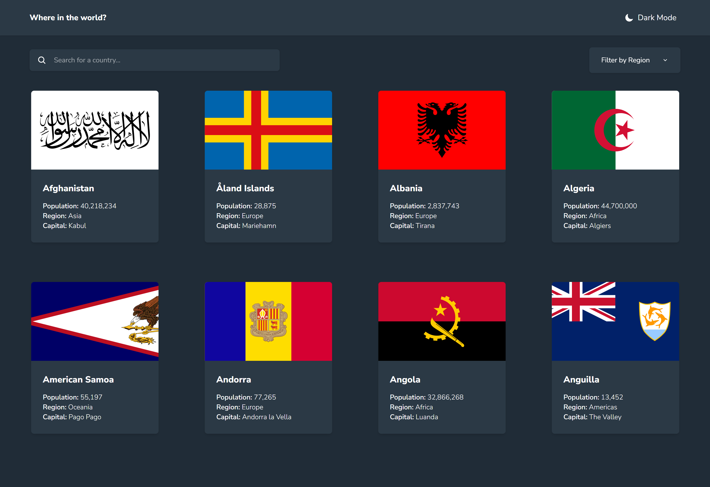

# Frontend Mentor - REST Countries API with color theme switcher solution

This is a solution to the [REST Countries API with color theme switcher challenge on Frontend Mentor](https://www.frontendmentor.io/challenges/rest-countries-api-with-color-theme-switcher-5cacc469fec04111f7b848ca). Frontend Mentor challenges help you improve your coding skills by building realistic projects.

## Table of contents

- [Overview](#overview)
  - [The challenge](#the-challenge)
  - [Screenshot](#screenshot)
  - [Links](#links)
- [My process](#my-process)
  - [Built with](#built-with)
  - [What I learned](#what-i-learned)
  - [Useful resources](#useful-resources)
- [Author](#author)
- [Acknowledgments](#acknowledgments)

## Overview

### The challenge

Users should be able to:

- See all countries from the API on the homepage
- Search for a country using an `input` field
- Filter countries by region
- Click on a country to see more detailed information on a separate page
- Click through to the border countries on the detail page
- Toggle the color scheme between light and dark mode _(optional)_

### Screenshot

- Desktop version.  
  

- Mobile version.  
  

### Links

- Solution URL: [Github](https://github.com/Abaljerind/rest-countries-api)
- Live Site URL: [Live Site](https://rest-countries-api-three-neon.vercel.app/)

## My process

### Built with

- Semantic HTML5 markup
- Flexbox
- CSS Grid
- REST API
- Responsive Website
- Mobile-first workflow
- React Router
- React Icons
- Prettier
- Git & Github
- [React](https://reactjs.org/) - JS library
- [Vite](https://vite.dev/) - React framework
- [TailwindCSS](https://tailwindcss.com/) - CSS framework

### What I learned

I’ve really learned a lot from JavaScript, especially its OOP concepts. It was really hard at first when I tried to figure out how to get the result I wanted, but after a while, I finally got it. It made me realize that breaking a big problem into smaller steps really helps.

By the way, the code below is for getting an object with the values of code and name.

```js
const proudOfThisFunc = () => {
  const names = detail?.borders.map((code) => {
    const match = countryName?.find((country) => country.alpha3Code === code);
    return match
      ? { code: match.alpha3Code, name: match.name }
      : { code, name: code };
  });
};
```

### Useful resources

- [TailwindCSS](https://tailwindcss.com/) - This helped me to do the styling more easy. I really liked this tailwindcss and will use it going forward.
- [Vercel](https://vercel.com) - This is an amazing website which helped me to upload my website into the internet. I'd recommend it to anyone still learning to use this website.

## Author

- Frontend Mentor - [@Abaljerind](https://www.frontendmentor.io/profile/Abaljerind)
- Github - [@Abaljerind](https://github.com/Abaljerind)
- LinkedIn - [@Abaljerind](https://www.linkedin.com/in/abal-jerind-baa90519a/)

## Acknowledgments

I want to thank me for believing in me, I want to thank me for doing all this hard work. I wanna thank me for having no days off. I wanna thank me for never quitting. I wanna thank me for being me at all times.
